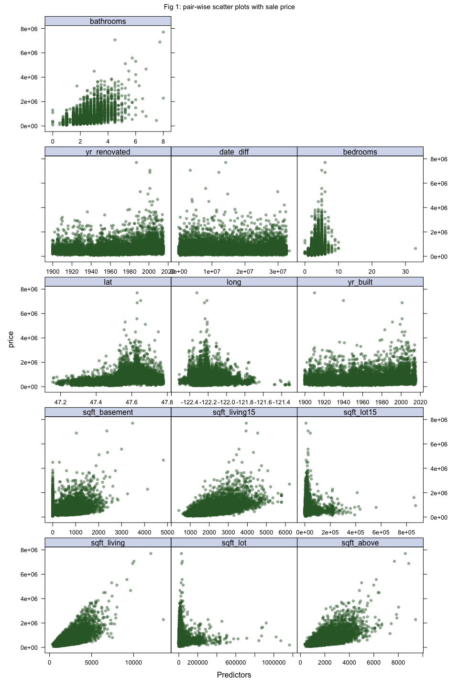
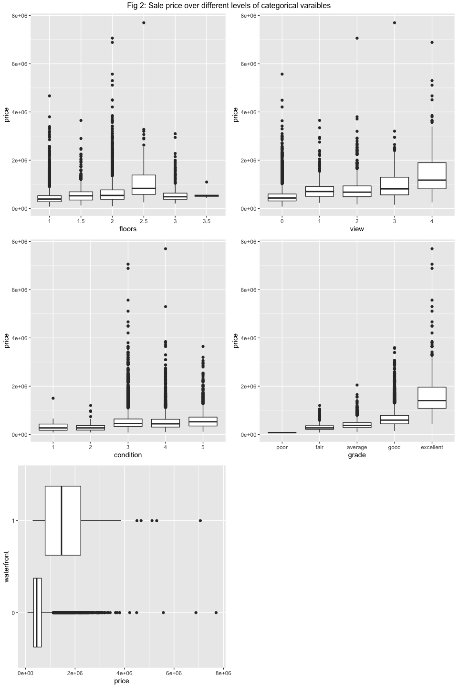
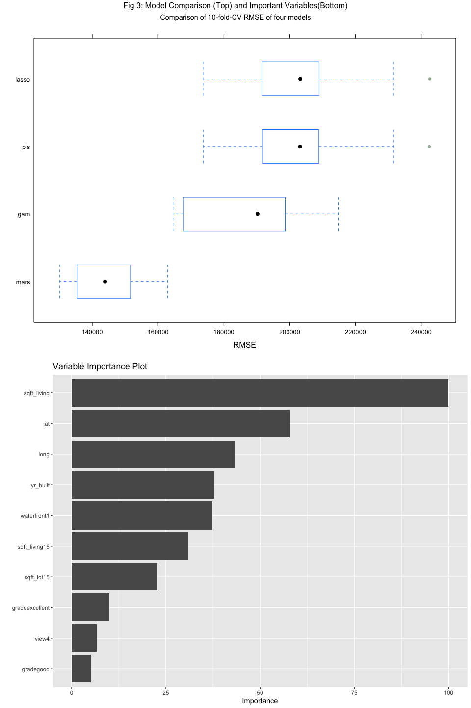
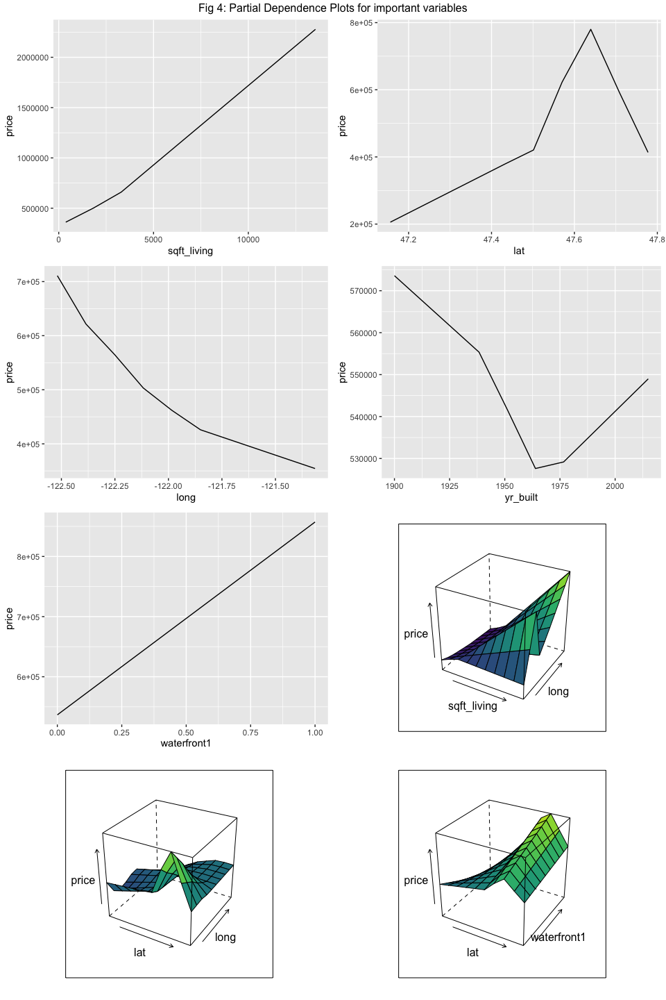

p8106 Midterm Project: House Sale Price in King County Seattle
================
Ruiqi Yan (ry2417)
3/18/2022

# Introduction

## Motivation

House is one of the most valuable property and most stable investment.
Due to the surge of covid-19 pandemic disease and the great inflation of
currency, people prefer more stable investement in recent years.
Moreover, many high-tech companies move to Seattle as well as the
software engineers who work for those companies reloacte here, so the
housing market is hot in Seattle. Then, the model that predict the sale
price of houses could enhance the competitiveness and promote the
effective strategies in the boiling housing market. Thus, we would like
to build a model that accurately and precisely preidcts the sale price
of house using several features of the house, such as location, space
and condition.

## Data description and cleaning

We have the dataset which record the information of house sales ocurred
from May/2/2014 to May/27/2015 in King County, Seattle. Except for the
reponse variable, the sale price, the dataset also contain 20 attributes
of each sale. Among these 20 feature variables, 14 are numerical,
including the `date` of sale, the number of `bedrooms`, the number of
`bathrooms`, the square footage of the interior living space
`sqft_living`, the square footage of the landscape `sqft_lot`, the
number of `floors`, the square footage of the space above ground level
`sqft_above`, the square footage of the space below ground level
`sqft_basement`, year initially built (`yr_built`) and renovated
(`yr_renovated`), latitude (`lat`) and longitude (`long`) of the house,
the square footage of the interior living space (`sqft_living15`) and
landsacpe (`sqft_lot15`) of the nearest 15 neighbors; 6 are qualitative
variables, such as the `id` of the sale, whether `waterfront` could be
overlooked, how good the `view`, the `conditon`, the `grade` of
construction and design and `zipcode`.  

There is no missing data in the dataset. The date of sale is transferred
to be the number of days lag from the first day, May/2/2014, as
`date_diff`. The year of renovation is 0 if no renovation was done, but
I believe that it is sensible to be the year of latest construction, so
all 0 in `yr_renovated` are replaced by the year of built. `waterfront`,
`view`, `condition` and `grade` are transferred to be dummy variables.
The `grade` of construction and design originally has 13 levels.
According to the description of the grade level, I collapse them into 5
levels: 1 to 3 as poor, 4 to 6 as fair, 7 as average, 8 to 10 as good
and 11 to 13 as excellent.Finally, there are 21613 observations, so it
is reasonable to partition the data into training set (80%) and testing
set (20%).

## Exploratory Data Analysis and Visulization

First of all, I explore the pair-wise relationship between all
quantitative predictors and the sale price respectively. On the Fig 1,
we can see that the area of living space, basement, above ground level,
the number of bedrooms and area of living space of nearest 15 neighbors
demonstrated positive linear association with the sale price; on the
other hand, latitude, longitude, the number of bathrooms and the area of
landscape of the house and the nearest 15 neighbors have piece-wise
relationship with the price. Moreover, the year of built and renovation
show moderate linear pattern. There are not noticeable pattern on the
days from the first day. To explore the date of sale, I also try to
visualize the distribution of price by month and quarter and no
interesting structure appeared.  

To further explore the pair-wise relationship with qualitative and
discrete variables which have the number of unique values less than 10,
the box plots are drawn for `waterfront`, `view`, `condition`, `grade`
and `floors`. The Fig 2 illustrates that the price tends to be higher
when `view`, `grade`, `condition` and `waterfront` are better. The
number of floors has piece-wise pattern.

## Models

The predictors included in the models are all predictor variables
excluding `id`, `zipcode`, `date` and `date_diff`. `id` is unique for
each observation. Either the combination of `lat` and `long`, or
`zipcode` explains the information about location, so `lat` and `long`
are kept as predictors realted to the location. `date` and `date_diff`
do not show interesting pattern in EDA so they are removed from the
model.  
Since there are some linear trends and some piece-wise linear trends in
the EDA, I would like to use some linear models, such as LASSO, partial
least squares (PLS) and two nonlinear models, Multivariate Adaptive
Regression Splines(MARS) as well as Generalized Additive Model (GAM), to
fit the model. Then, using the 10-fold-CV to compare models and select
the final model.  

According to the summary of RMSE in Table 1 and the comparison shown in
first plot in Fig 3, MARS model has the overt lower RMSE than other
three models, so **MARS** is selected to be the final model. The
selected features and coefficients of the final model are shown in Table
2.

### Assumption

Given each cut point for a predictor, two new features, the hinge
functions of the cut point, are created. MARS model automatically
selects cut points and hinge functions as the features of the model and
fits linear regression on these features, so the model fits piece-wise
linear spline on selected cut points. we assume that the underlying true
model is the composition of piece-wise linear splines of some
predictors, the quadratic of some predictors and the interaction of some
predictors.

### Tuning Parameters

For MARS, there are two tuning parameters: the degree of features and
the number of term. They are selected by 10-folds cross-validation. The
combination with lowest RMSE is the selected parameters in the final
model. The degree 2 and 39 terms have lowest RMSE. For GAM, the tuning
parameters are the degree of freedom for each smooth function and
whether or not the fitting executes feature selection. Those degree of
freedom are chosen through generalized cross validation and selected or
not is determined by 10-fold-CV. For LASSO, the tuning parameter is the
shrinkage coefficient *λ*. The *λ* is selected by 10-fold-CV.
*λ* = 265.0716058 has lowest RMSE. For PLS, the tuning parameter is the
number of components in the model and selected based on the 10-fold-CV.
20 components has lowest RMSE.

### Final Model

**Train/Test Performance**  
The performance of model is evaluated by rooted mean square error
(RMSE). With the final model, the training RMSE is 1.3550868^{5} and the
testing RMSE is 1.3724117^{5}. The training error is lower than the
testing error and the testing error is not much higher than the training
error, so the model is not over-fitting. The testing error/training
error is much lower than the training error of ordinary linear
regression, 2.0459021^{5}.  

**Important Variables**  
We can visualize the rank of the importance of predictors in this model
through the second plot in Fig 3. The `sqft_living`, `lat`, `long`,
`yr_built` and `waterfront` play importance roles in predicting the
price. These predictors stand for the area, the location, the age and
the environment of the property, so it is very intuitive that they are
strongly correlate with the price of the property.  

Since the final model is piece-wise with degree of 2, it is not
straightforward to interpret the model directly through the coefficient
values. We could use partial dependence plots (Fig 4) to better
understand the relationship between the important variables and the
price. For the area of the house, the price of larger house is higher.
In respect to the location, when the longitude increases, the location
goes further to east and the price is lower; the price is highest with
latitude around 47.65 and goes down when latitude departs from this
value. The price is lowest when the year of built is 1967 and goes up
when the year of built deviates from this year. The houses in waterfront
have higher price than those not.  

The degree of final model is 2, so some interaction PDPs (Fig 4) are
helpful as well. According to Fig 10, at some middle longitude, the
space strongly boosts the price; in the most western part, the larger
house has lower price. The second interaction PDP shows the fluctuation
of the price over location and areas with extraordinarily high and low
price. In the third interaction PDP, we could see that waterfront is not
the advantage of the house in the low latitude area, the northern
area.  

**Limitation**  
One limitation is that the model uses nonlinear functions so
interpretation is complicate. Another limitation is that some important
features have not been included in the model such as the number of
garages, fireplace, or the quality of the appliances, so the
training/testing error of MARS is not moderately but not extrmely low.
However, the training/testing error is much lower than that of the
linear model, so the model should be flexible enough to capture the
underlying truth of the relationship between predictors we have and the
price.

## Conclusion

MARS model outperforms linear models in predicting the price of house in
King County Seattle, so the relationship between housing price and other
feature variables of the house such as space, location, age and quality
is rather nonlinear than linear. This conclusion is consistent with
findings in the EDA that some predictors have piece-wise relationships
with the sale price.  
As what we expect, the space, the location, the age and the environment
mainly determine the price of the house. Larger houses tend to have
higher price, but at the most western part, large space of the house has
reverse impact on the price. Houses in waterfront have higher price, but
the waterfront is not the advantage of the house in the northern area.  
The degree of features in the final model is 2, suggesting that the
interaction effects between predictors play important role in predicting
the price.  
The prediction error of the MARS model is around $130000. The
unexplained variance could be caused by other predictors not included in
the data, but the model has much better performance than ordinary linear
regression, so the model could capture some the underlying true
relationship between features houses and the price of houses in King
County, Seattle.

## Appendix I: Figures and Tables

<!-- -->

<!-- -->

|       |     Min. |  1st Qu. |   Median |     Mean |  3rd Qu. |     Max. | NA’s |
|:------|---------:|---------:|---------:|---------:|---------:|---------:|-----:|
| lasso | 173847.6 | 193778.8 | 203217.8 | 204984.0 | 207896.5 | 242592.6 |    0 |
| pls   | 173809.8 | 193933.8 | 203168.9 | 204963.1 | 207800.6 | 242416.4 |    0 |
| gam   | 164533.5 | 171201.3 | 190220.4 | 187768.9 | 198073.3 | 214785.4 |    0 |
| mars  | 130111.9 | 136423.4 | 143869.1 | 145017.8 | 150196.6 | 162907.4 |    0 |

Summary Statistics of 10-fold-CV RMSE across models

|                                             |             x |
|:--------------------------------------------|--------------:|
| (Intercept)                                 |  5.672540e+05 |
| h(sqft\_living-3010)                        |  7.283194e+01 |
| h(3010-sqft\_living)                        | -4.479962e+02 |
| h(lat-47.6545)                              | -1.588814e+06 |
| h(sqft\_living-3010) \* h(long- -122.24)    | -6.197240e+04 |
| h(sqft\_living-3010) \* h(-122.24-long)     | -8.194075e+02 |
| waterfront1                                 |  1.055056e+06 |
| h(3010-sqft\_living) \* h(lat-47.4846)      |  1.492171e+03 |
| h(3010-sqft\_living) \* h(47.4846-lat)      | -1.995175e+03 |
| h(sqft\_living15-3300)                      |  5.021661e+02 |
| h(sqft\_living-3010) \* h(long- -122.137)   |  4.690443e+03 |
| h(sqft\_living-3010) \* h(yr\_built-1967)   |  6.430834e+00 |
| h(sqft\_living-3010) \* h(1967-yr\_built)   |  8.609759e+00 |
| h(yr\_built-1939) \* h(sqft\_living15-3300) | -7.143844e+00 |
| h(1939-yr\_built) \* h(sqft\_living15-3300) | -1.837132e+01 |
| h(sqft\_living-3830) \* waterfront1         |  9.508354e+01 |
| h(3830-sqft\_living) \* waterfront1         | -2.362773e+02 |
| h(sqft\_living-3010) \* h(long- -122.245)   |  5.753932e+04 |
| h(-121.881-long)                            |  2.881391e+05 |
| h(47.6545-lat) \* h(long- -122.33)          | -1.447066e+06 |
| h(47.6545-lat) \* h(-122.33-long)           |  5.205880e+06 |
| gradeexcellent                              |  2.293762e+05 |
| h(-121.881-long) \* h(sqft\_living15-1830)  |  3.410095e+02 |
| gradegood                                   |  6.010682e+04 |
| h(sqft\_lot-3766)                           |  4.639376e-01 |
| h(3766-sqft\_lot)                           | -2.641377e+01 |
| view4                                       |  2.268965e+05 |
| waterfront1 \* h(lat-47.5925)               | -1.921962e+06 |
| waterfront1 \* h(47.5925-lat)               | -3.201797e+06 |
| h(lat-47.6323) \* h(-121.881-long)          | -1.596829e+07 |
| h(47.6323-lat) \* h(-121.881-long)          | -2.218987e+06 |
| h(lat-47.4987) \* h(-121.881-long)          |  8.428096e+06 |
| h(sqft\_living-3010) \* h(47.6545-lat)      | -3.452368e+02 |
| h(3010-sqft\_living) \* h(47.6545-lat)      |  2.296342e+03 |
| h(-121.881-long) \* h(sqft\_lot15-19353)    | -9.509817e-01 |
| h(-121.881-long) \* h(19353-sqft\_lot15)    | -1.947632e+01 |
| h(sqft\_above-3840) \* h(-121.881-long)     |  4.571226e+02 |
| h(3840-sqft\_above) \* h(-121.881-long)     | -1.034430e+02 |
| h(sqft\_lot-3766) \* h(33976-sqft\_lot15)   | -1.130000e-05 |

Coefficients of final MARS model

<!-- -->

<!-- -->

## Appendix II R code

``` r
library(tidyverse)
library(caret)
library(skimr)
library(ggpubr)
library(mgcv)
library(vip)
```

``` r
housing_price = read_csv("kc_house_data.csv") %>% drop_na() %>% arrange(date)

housing_price = housing_price %>% 
  mutate(
    yr_renovated = ifelse(yr_renovated == 0, yr_built, yr_renovated),
    date_diff = as.numeric(difftime(date, housing_price$date[1], "days")),
    waterfront = factor(waterfront, levels = as.character(0:1)),
    view = factor(view, levels = as.character(0:4)),
    condition = factor(condition, levels = as.character(1:5)),
    grade = factor(grade),
    grade = fct_collapse(grade,
                         poor = as.character(1:3),
                         fair = as.character(4:6),
                         average = as.character(7),
                         good = as.character(8:10),
                         excellent = as.character(11:13)))

set.seed(2022)
indexTrain = createDataPartition(y = housing_price$price, p = 0.8, list = FALSE)
train_df = housing_price[indexTrain,]
test_df = housing_price[-indexTrain,]
```

``` r
theme1 <- trellis.par.get()
theme1$plot.symbol$col <- rgb(.2, .4, .2, .5)
theme1$plot.symbol$pch <- 16
theme1$plot.line$col <- rgb(.8, .1, .1, 1)
theme1$plot.line$lwd <- 2
theme1$strip.background$col <- rgb(.0, .2, .6, .2)
trellis.par.set(theme1)

train_x_numeric = train_df %>% dplyr::select(sqft_living, sqft_lot, sqft_above,
                                               sqft_basement, sqft_living15, sqft_lot15,
                                               lat, long, yr_built, yr_renovated,
                                             date_diff,bedrooms, bathrooms)

train_y = train_df$price

featurePlot(train_x_numeric, train_y, plot = "scatter", labels = c("Predictors", "price"), type = c("p"), layout = c(3,5), main= "Fig 1: pair-wise scatter plots with sale price",
            par.settings=list(par.main.text=list(cex=0.9, font = 1)))
```

``` r
p1 = train_df %>% 
  mutate(
    floors = factor(floors)
  ) %>% 
  ggplot(aes(y = price, x = floors)) +
  geom_boxplot()

p2 = train_df %>%
  ggplot(aes(y = price, x = view)) +
  geom_boxplot()

p3 = train_df %>%
  ggplot(aes(y = price, x = condition)) +
  geom_boxplot()

p4 = train_df %>%
  ggplot(aes(y = price, x = grade)) +
  geom_boxplot()

p5 = train_df %>%
  ggplot(aes(y = price, x = waterfront)) +
  geom_boxplot() +
  coord_flip()

fig_2 = ggarrange(p1,p2,p3,p4,p5, ncol
                     = 2, nrow = 3)
annotate_figure(fig_2, top = text_grob("Fig 2: Sale price over different levels of categorical varaibles"))
```

``` r
train_df_final = train_df %>% dplyr::select(-id, -zipcode, -date, -date_diff)
x_train = model.matrix(price~., data = train_df_final)[,-1]
y_train = train_df_final$price

test_df_final = test_df %>% dplyr::select(-id, -zipcode, -date, -date_diff)
x_test =  model.matrix(price~., data = test_df_final)[,-1]
y_test = test_df_final$price
```

``` r
ctrl = trainControl(method = "cv", number = 10)
set.seed(2021)
lasso_fit = train(x_train, y_train,
                 method = "glmnet",
                 tuneGrid = expand.grid(alpha = 1,
                                        lambda = exp(seq(-3,6,0.01))),
                 trControl = ctrl)
set.seed(2021)
pls_fit = train(x_train, y_train, 
                 method = "pls", 
                 tuneGrid = data.frame(ncomp = 1:26),
                 preProcess = c("center", "scale"),
                 trControl = ctrl)

set.seed(2021)
gam_fit = train(x_train, y_train,
                 method = "gam",
                 trControl = ctrl)

mars_grid <- expand.grid(degree = 1:3,
nprune = 35:45)

set.seed(2021)
mars_fit = train(x_train, y_train,
                 method = "earth",
                 tuneGrid = mars_grid,
                 trControl = ctrl)
```

``` r
resamp = resamples(list(lasso = lasso_fit,
                        pls = pls_fit,
                        gam = gam_fit,
                        mars = mars_fit))
knitr::kable(summary(resamp)$statistics$RMSE, caption = "Summary Statistics of 10-fold-CV RMSE across models")
```

``` r
knitr::kable(coef(mars_fit$finalModel), caption = "Coefficients of final MARS model")
```

``` r
p6 = bwplot(resamp, metric = "RMSE", main = "Comparison of 10-fold-CV RMSE of four models",
            par.settings=list(par.main.text=list(cex=0.9, font = 1)))

p7 = vip(mars_fit)+ggtitle("Variable Importance Plot")

fig_3 = ggarrange(p6, p7, ncol
                     = 1)
annotate_figure(fig_3, top = text_grob("Fig 3: Model Comparison (Top) and Important Variables(Bottom)"))
```

``` r
pdp1 <- pdp::partial(mars_fit, pred.var = c("sqft_living"), grid.resolution = 10) %>% autoplot(ylab = "price")
pdp2 <- pdp::partial(mars_fit, pred.var = c("lat"), grid.resolution = 10) %>% autoplot(ylab = "price")
pdp3 <- pdp::partial(mars_fit, pred.var = c("long"), grid.resolution = 10) %>% autoplot(ylab = "price")
pdp4 <- pdp::partial(mars_fit, pred.var = c("yr_built"), grid.resolution = 10) %>% autoplot(ylab = "price")
pdp5 <- pdp::partial(mars_fit, pred.var = c("waterfront1"), grid.resolution = 10) %>% autoplot(ylab = "price")

pdp6 = pdp::partial(mars_fit, pred.var = c("sqft_living", "long"),
grid.resolution = 10) %>%
pdp::plotPartial(levelplot = FALSE, zlab = "price", drape = TRUE,
screen = list(z = -30, x = -60), colorkey = F)

pdp7 = pdp::partial(mars_fit, pred.var = c("lat", "long"),
grid.resolution = 10) %>%
pdp::plotPartial(levelplot = FALSE, zlab = "price", drape = TRUE,
screen = list(z = -30, x = -60), colorkey = F)


pdp8 = pdp::partial(mars_fit, pred.var = c("lat", "waterfront1"),
grid.resolution = 10) %>%
pdp::plotPartial(levelplot = FALSE, zlab = "price", drape = TRUE,
screen = list(z = -30, x = -60), colorkey = F)

pdp::grid.arrange(pdp1, pdp2, pdp3, pdp4, pdp5, pdp6, pdp7, pdp8, ncol = 2,
                  top="Fig 4: Partial Dependence Plots for important variables")
```
